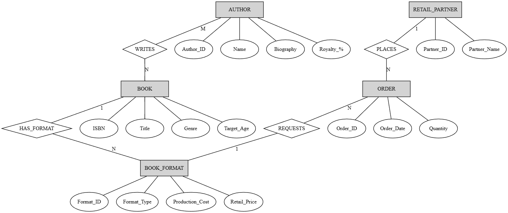
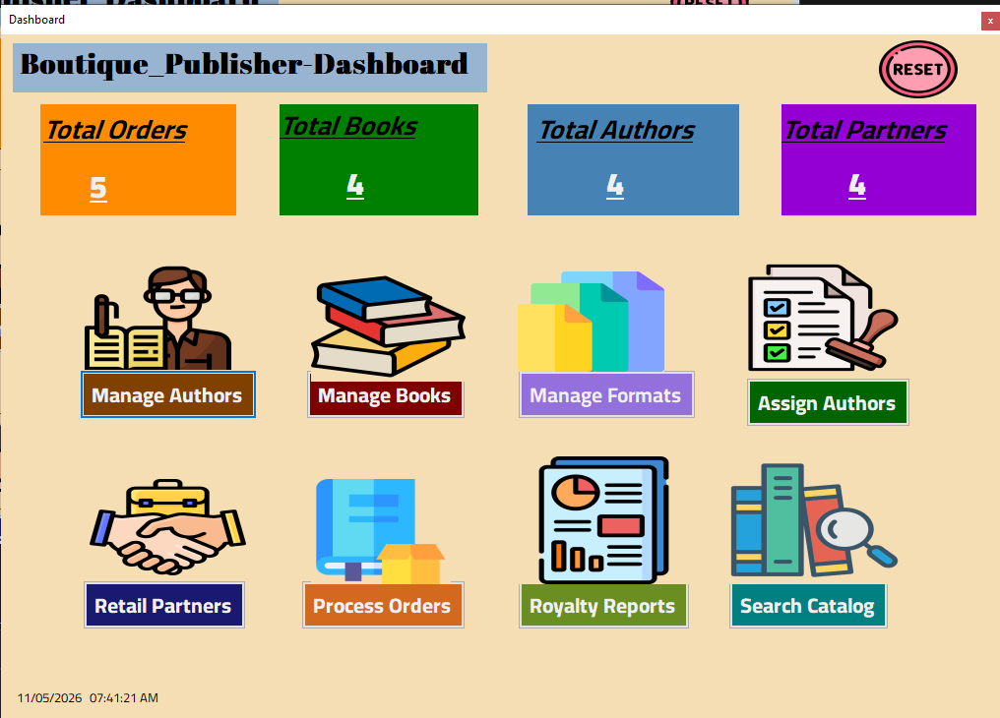
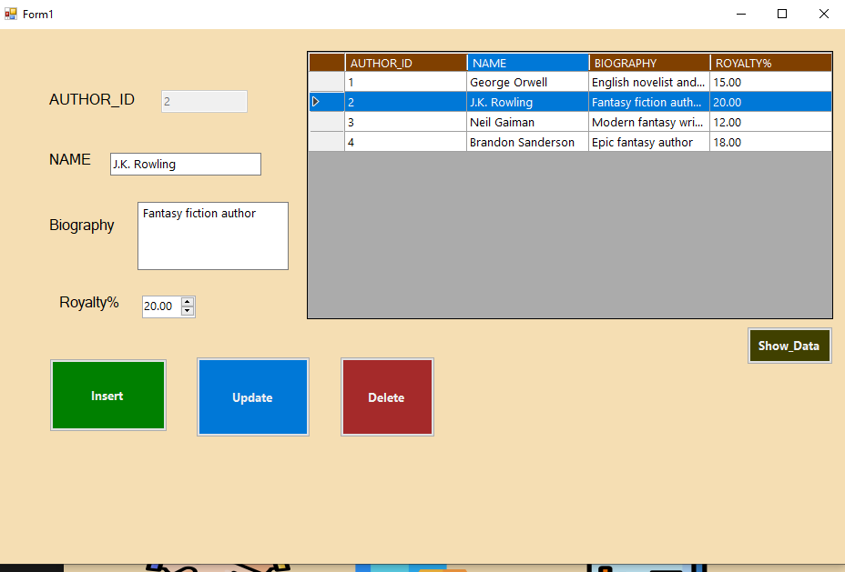
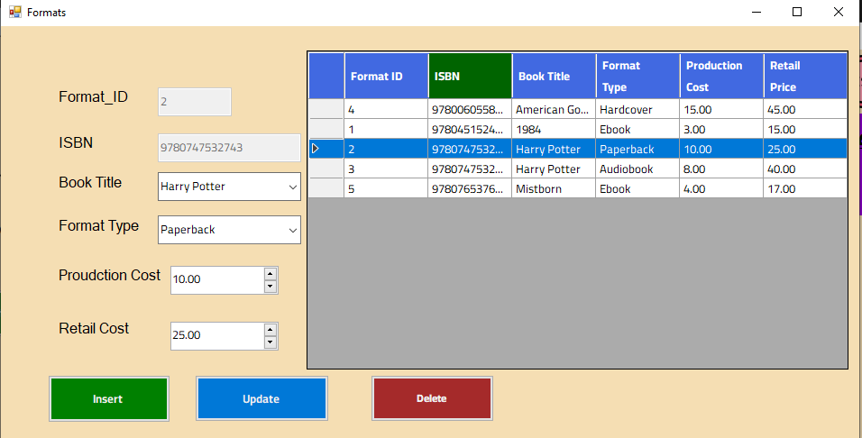
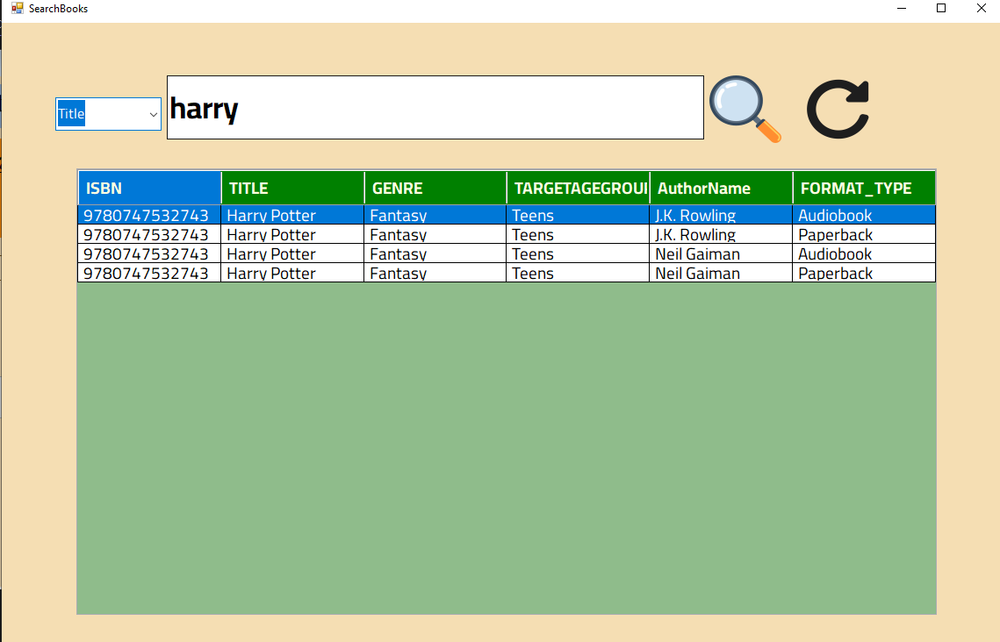
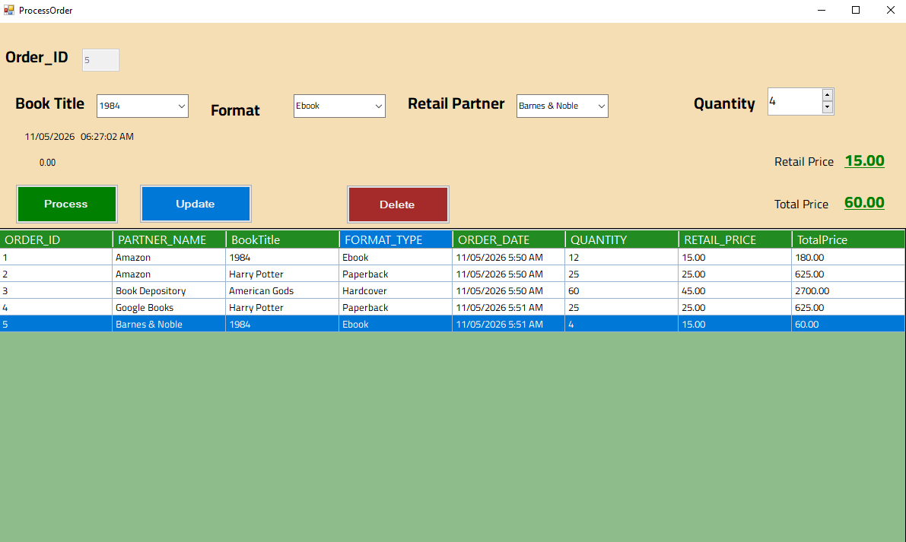
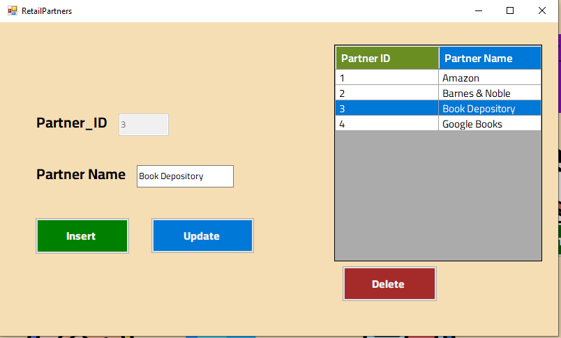
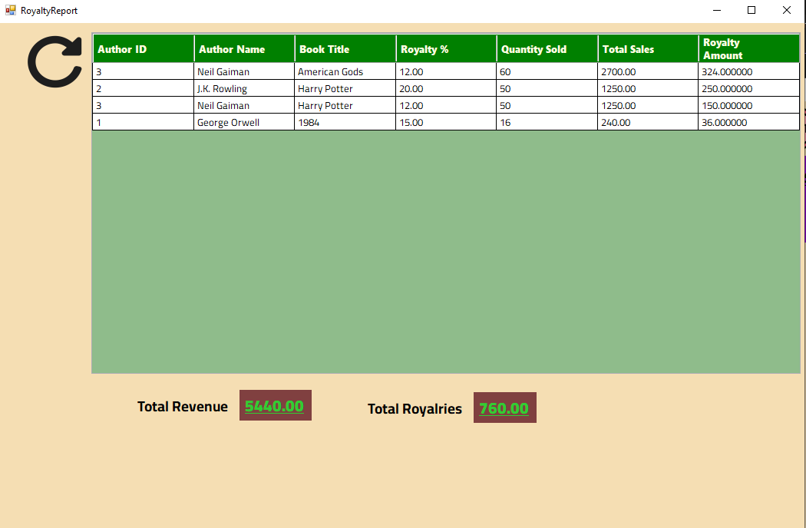
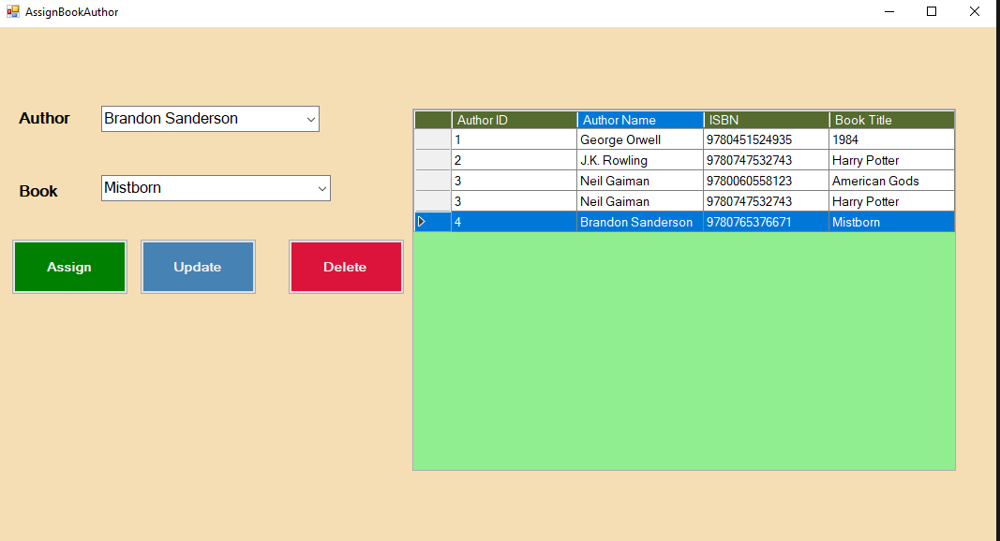

# Boutique Publisher Management System

## Overview

Boutique Publisher Management System is a Windows Forms desktop application developed using C#, .NET Framework, and Microsoft SQL Server.

The system is designed to help publishing companies manage:

* Authors
* Books
* Book Formats
* Retail Partners
* Orders
* Author Royalties
* Sales Reports

The project demonstrates database design, relational database implementation, CRUD operations, business logic processing, and dashboard/report generation.

---
# Screenshots

## Entity Relationship Diagram (ERD)

<p align="center">
  
</p>

---

# Screenshots

## Dashboard

<p align="center">
  
</p>

---

## Entity Relationship Diagram (ERD)

<p align="center">
  
</p>

---

| Authors | Books |
|---|---|
|  |  |

| Formats | Search Books |
|---|---|
|  |  |

| Orders | Partners |
|---|---|
|  |  |

| Report | Assignment |
|---|---|
|  |  |

# Technologies Used

* C#
* Windows Forms (.NET)
* Microsoft SQL Server
* ADO.NET
* Visual Studio

---

# Features

## Author Management

* Add new authors
* Update author information
* Delete authors
* View authors
* Store biography and royalty percentage

## Book Management

* Add books
* Update books
* Delete books
* Search books
* Display all books
* Advanced book search using:
  * Title
  * Genre
  * ISBN
  * Author Name
  * Release Format

## Author Assignment

* Assign one or multiple authors to books
* Support co-authorship
* Display author-book relationships


## Format Management

* Add multiple formats for books:

  * Hardcover
  * Paperback
  * Ebook
  * Audiobook
* Store production cost and retail price

## Retail Partner Management

* Add retail partners
* Update retail partner information
* Delete retail partners
* View all partners

## Order Processing

* Process book orders
* Automatically calculate:

  * Retail price
  * Total price
* Automatically store order date and time

## Royalty Report

* Automatically calculate royalties based on:

```text
Retail Price × Quantity × Royalty Percentage
```

* Display:

  * Total Sales
  * Quantity Sold
  * Royalty Percentage
  * Royalty Amount

## Dashboard

* Total Books
* Total Authors
* Total Orders
* Total Partners
* Navigation between forms

---

# Database Structure

## Main Tables

* AUTHOR
* BOOK
* AUTHOR_BOOK
* FORMAT
* RETAILPARTNER
* ORDER

---

# Entity Relationships

* One Author can write many Books
* One Book can have many Authors
* One Book can have many Formats
* One Retail Partner can process many Orders
* One Format can appear in many Orders

---

# Project Structure

```text
Boutique_Publisher/
│
├── Dashboard.cs
├── Author.cs
├── Books.cs
├── Formats.cs
├── RetailPartners.cs
├── ProcessOrder.cs
├── AssignBookAuthor.cs
├── RoyaltyReport.cs
├── DatabaseHelper.cs
├── App.config
└── BoutiquePublisherDB.sql
```

---

# How to Run the Project

## Requirements

Before running the project, make sure you have installed:

* Visual Studio
* .NET Framework
* Microsoft SQL Server
* SQL Server Management Studio (SSMS)

---

## 1. Clone the Repository

```bash
git clone <repository-link>
```

Or download the project as ZIP and extract it.

---

## 2. Open the Solution

Open the following file using Visual Studio:

```text
Boutique_Publisher.sln
```

---

## 3. Create the Database

Open SQL Server Management Studio (SSMS).

Then open and execute:

```text
Boutique_Publisher.sql
```

The script will automatically:

* Create the database
* Create all tables
* Create primary keys
* Create foreign keys

---

## 4. Configure SQL Server Connection

Open:

```text
App.config
```

Update the SQL Server instance if needed:

```xml
<connectionStrings>
  <add name="BoutiquePublisherDB"
       connectionString="Data Source=.\SQLEXPRESS;Initial Catalog=BoutiquePublisherDB;Integrated Security=True"
       providerName="System.Data.SqlClient"/>
</connectionStrings>
```

Also open:

```text
DatabaseHelper.cs
```

Update:

```csharp
public static string ConnectionString =
"Data Source=.\\SQLEXPRESS;Initial Catalog=BoutiquePublisherDB;Integrated Security=True";
```

---

## 5. SQL Server Instance Examples

Replace:

```text
.\SQLEXPRESS
```

with your actual SQL Server instance if different.

Examples:

```text
DESKTOP-XXXX\SQLEXPRESS
localhost
.
MSSQLLocalDB
```

---

## 6. Restore Database Connection

If the application cannot connect:

* Open SQL Server Configuration Manager
* Enable SQL Server services
* Make sure SQL Server Authentication is enabled
* Verify the database name is:

```text
BoutiquePublisherDB
```

---

## 7. Build the Project

Inside Visual Studio:

```text
Build → Build Solution
```

Shortcut:

```text
Ctrl + Shift + B
```

---

## 8. Run the Application

Press:

```text
F5
```

or click:

```text
Start Debugging
```

---

## 9. Application Workflow

1. Add Authors
2. Add Books
3. Assign Authors to Books
4. Add Book Formats
5. Add Retail Partners
6. Process Orders
7. Search Books
8. Generate Royalty Reports
9. View Dashboard Statistics

---

# Royalty Calculation Example

## Example

* Retail Price = 40
* Quantity = 10
* Royalty Percentage = 15%

## Calculations

```text
Total Sales = 40 × 10 = 400

Royalty Amount = 400 × 15% = 60
```


---

# License

This project is developed for educational purposes.
